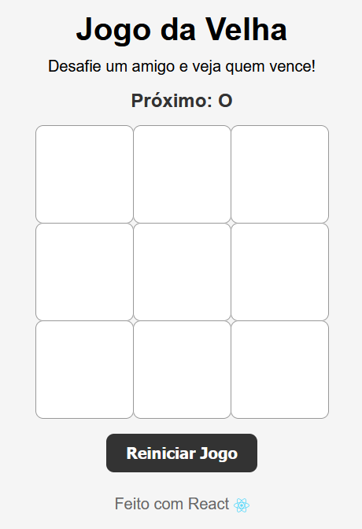
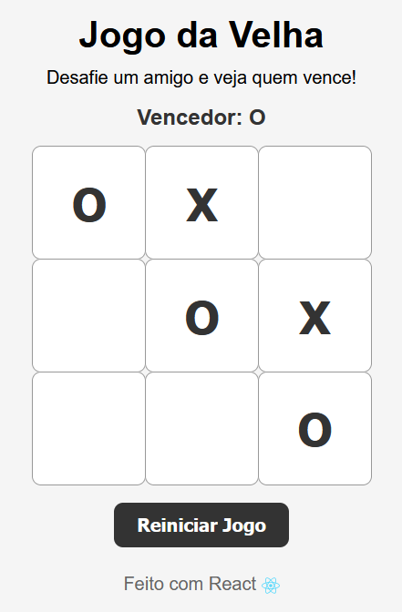

# React  - Tutorial: Jogo da Velha

[Tutorial: Jogo da Velha](https://pt-br.react.dev/learn/tutorial-tic-tac-toe)

React é uma biblioteca JavaScript para renderizar interfaces de usuário (UI). A interface do usuário é construída a partir de pequenas unidades, como botões, texto e imagens. O React permite combiná-los em componentes. encaixáveis ​​e reutilizáveis. 




## 🚀 Como executar localmente

1.  Clone este repositório:

    ``` bash
    https://github.com/dekomonte/react-jogo-da-velha
    cd jogo-da-velha-react
    ```

2.  Instale as dependências:

    ``` bash
    npm install
    ```

3.  Execute a aplicação:

    ``` bash
    npm run start dev
    ```

4.  Abra no navegador:

        http://localhost:3000

 ## 🛠️ Tecnologias utilizadas
-   [React](https://react.dev/)\
-   JavaScript (ES6+)\
-   CSS
